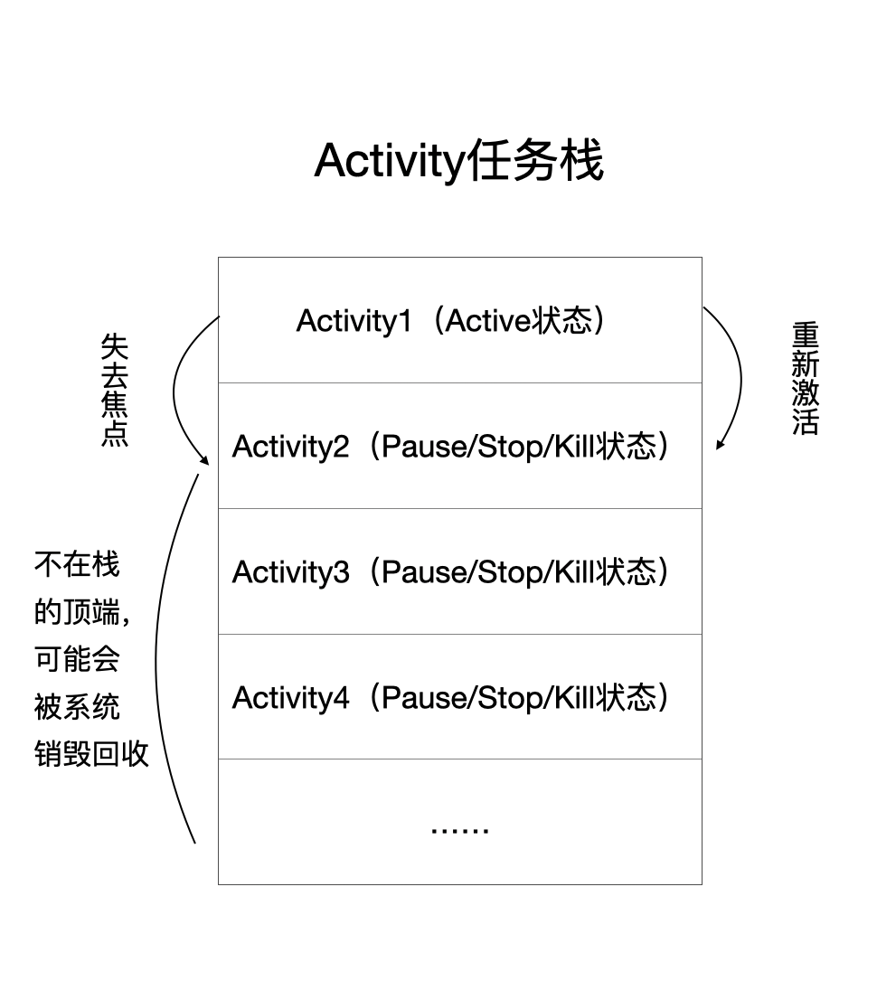
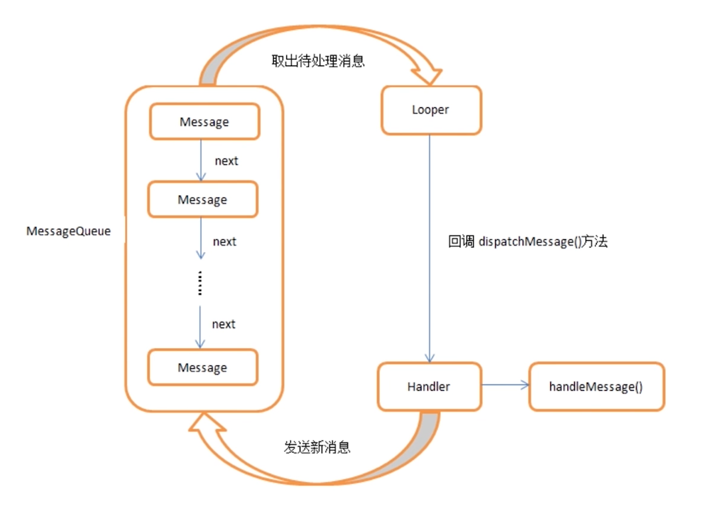

# Android笔记

1. 选一个自己相对擅长的领域
2. 基础要背
3. 试着去了解这个领域市面上的技术
4. 如果有时间的话，研究其中一个众所周知的库的源码

## Activity

Activity是与用户交互的接口

Android系统通过Activity栈的形式来管理Activity

###  Activity生命周期

* Activity4中状态
	
	* Active：Activity处于栈顶、可见、可交互
	* Paused：被非全屏Activity挡住，可见但不可交互
	* Stopped：被完全覆盖、部分成员变量存在，不可见
	* Killed：系统回收掉
	
* Activity生命周期
	
	
	
	* Activity启动->onCreate->onStart(可见)->onResume(可见 用户可以操作)
	* 点Home回到主界面(Activity不可见)->onPause->onStop
	* 再次回到原Activity->onRestart(不可见->可见)->onStart->onResume
	* 退出当前Activity->onPause->onStop->onDestroy
	* 异常终止的时候onSaveInstanceState（Android3.0之前onResume之后调用，3.0之后onPause之后调用，9.0之后onStop之后调用）自动调用保存数据，onRestoreInstanceState（onStart之后）方法恢复数据，里面的Bundle参数一定不为空，onCreate里面的Bundle参数可能为空
	
* Android进程优先级
	* 前台
	* 可见
	* 服务
	* 后台
	* 空
### Android任务栈

### Activity之间通信

* Intent/Bundle
* 类静态变量
* 全局变量

### Activity与Fragment通信

* Activity将数据传递给Fragment

    * Bundle `fragment.setArguments(bundle);`
    * 直接在Activity中定义方法

* Fragment将数据传递给Activity

    * 接口

        1. 在Fragment中定义一个内部回调接口，Activity实现这个接口

        2. Fragment的方法onAttach()

        3. 调用onDetach方法，这个时候要把传递进来的Activity对象释放掉

### Activity与Service数据通信

* 绑定服务，利用ServiceConnection类
* 简单通信，利用Intent进行传值
* 定义一个callback接口来监听服务中的进程变化

### Activity启动模式

* standard
    * 在不指定启动模式的前提下，系统默认使用该模式启动Activity
    * 每次启动一个Activity都会创建一个新的实例
    * Activity它的onCreate(), onStart(), onResume()都会执行
* singleTop栈顶复用 
    * 当前栈中已有该Activity的实例并且该实例位于栈顶，不会创建新实例，调用onNewInstance()
    * 当前栈中已有该Activity的实例并且该实例不位于栈顶，会创建新实例
    * 当前栈中不存在该Activity的实例，会创建新实例
    * 应用场景 IM对话框 新闻客户端推送
* singleTask栈内复用 提到栈顶(此Activity)并移除在此之上的所有Activity 调用onNewInstance
    * 首先根据taskAffinity（默认为包名）去寻找当前是否存在一个对应名字的任务栈
    * 如果不存在，则会建一个新的Task
    * 如果存在，则得到该任务栈，查找该任务栈中是否存在该Activity
    * 应用场景 应用主页面
* singleInstance 独享一个栈
    * 以singleInstance模式启动Activity具有全局唯一性
    * 如果在启动这样的Activity时，已经存在了一个实例
    * 以singleInstance模式启动的Activity具有独占性
    * 应用场景 呼叫来电  

### scheme协议

## Service

### Service的生命周期

* startService多次调用，onCreate只会执行一次，onStartCommand执行多次
* stopService调用，内部会执行onDestroy方法，但如果bind后，调用stopService也不会停止服务，只用调用unBindService后才能停止服务
* bindService调用后，onCreate->onBind
* unBindService条用后，onUnbind->onDestroy

### Service的应用场景，以及和Thread区别

* Service是什么

    Service是一种可以在后台执行长时间运行操作而没有用户界面的应用组件。
    运行在主线程（不能执行耗时操作）

* Thread是什么

    Thread是程序执行的最小单元，它是分配CPU的基本单位

    * Thread的生命周期
        * 新建
        * 就绪
        * 运行
        * 死亡
        * 阻塞
    * Thread的致命缺点：无法控制
        * 如果执行Thread的Activity销毁之后，Thread就变成野线程了，无法对其进行状态监听和控制
        * 场景：Thread需要连续不停地每隔一段时间就要连接服务器做一次同步（可以在Service里面创建Thread并控制它）

* Service和Thread的区别
    * 定义  service运行在主线程 Thread相对独立
    * 实际开发  Thread执行耗时操作
    * 应用场景  Service后台播放音乐 天气预报通知 数据统计

### Service和IntentService的区别

* 不建议在Service中编写耗时的逻辑和操作，否则会引起ANR

* IntentService内部有一个工作线程HandlerThread来处理耗时操作，同时只会执行一个工作线程，开启多次会加入线程队列
* IntentService是继承并处理异步请求的一个类
* 内有一个工作线程来处理耗时操作
* IntentService内部则是通过消息的方式发送给HandlerThread的，然后由Handler中的Looper来处理消息

### 开启service的两种方式以及区别

#####1 startService 

通过startService方法启动Service会回调onStartCommand

* 定义一个类继承Service
* 在Manifest.xml文件中配置该Service
* 使用Context的startService(Intent)方法启动该Service
* 不再使用时，调用stopService(Intent)方法停止该Service

#####2 bindService

* 创建BindService服务端，继承自Service并在类中，创建一个实现IBinder接口的实例对象并提供公共方法给客户端调用
* 从onBind()回调方法返回此Binder实例
* 在客户端中，从onServiceConnected()回调方法接收Binder并使用提供的方法调用绑定服务

### 启动服务和绑定服务先后次序问题

* 先绑定服务再启动服务
    * 退出当前Activity，会调用onUnbind但不会销毁

* 先启动服务再绑定服务
    * 退出当前Activity，会调用onUnbind但不会销毁

绑定服务是依托绑定的Activity，而启动服务则是依托自身Service

启动服务的优先级比绑定服务高

服务在其托管进程的主线程中运行（UI线程）

## 序列化：Parcelable和Serializable

序列化：内存中对象->磁盘

反序列化：磁盘中对象->内存

### Serializable

* Java中提供的序列化接口
* 性能低，内存开销大

### Parcelable

* Android中提供的序列化接口
* 内存开销小

### 总结

* 两者实现差异
* 两者效率对比
* 存储到存储设备上推荐Serializable
* 在内存中传递推荐Parcelable

## Binder

### AIDL

进程间通信（IPC）机制

1. 创建AIDL：实体对象、新建AIDL文件、make工程
2. 服务端：新建Service、创建Binder对象、定义方法
3. 客户端：实现serviceConnection、BindService

### Linux内核基础知识

* 进程隔离/虚拟地址空间
* 系统调用 
* Binder驱动

### Binder通信机制

##### 为什么使用Binder

* Android使用的Linux内核拥有着很多的跨进程通信机制
* 性能
* 安全

##### Binder通信模型

* 通信录：Binder驱动

##### 到底什么是Binder

* 通常意义下，Binder是一种通信机制
* 对于Service进程来说，Binder指的是Binder本地对象/对与Client来说，Binder指的是Binder代理对象
* 对于传输过程而言，Binder是可以跨进程传递的对象

## Fragment

### Fragment为什么被称为第五大组件

* 使用频率高
* 有自己的生命周期
* 动态灵活加载到Activity中
	* 依附Activity
### Fragment加载到Activity的两种方式

* 添加Fragment到Activity布局文件中
* 动态在Activity中添加Fragment

### FragmentPagerAdapter和FragmentStatePagerAdapter区别

* FragmentPagerAdapter页面较少  销毁时调用detach UI分离
* FragmentStatePagerAdapter页面较多 销毁时调用remove 回收内存

### Fragment生命周期

### Fragment通信

* 在Fragment中调用Activity的方法 getActivity()
* 在Activity中调用Fragment中方法 接口回调
* 在Fragment中调用Fragment中方法 findFragmentById
### Fragment的replace、add、remove

## Broadcast receiver

### 广播

##### 广播的定义
在Android中，Broadcast是一种广泛运用的在应用程序之间传输信息的机制，Android中我们要发送的广播是一个Intent，这个Intent中可以携带我们要传送的数据

##### 广播的使用场景
* 同一App具有多个进程的不同组件之间的消息通信
* 不同App之间的组件之间消息通信

##### 广播种类
* Normal Broadcast：Context.sendBroadcast
* System Broadcast: Context.sendOrderedBaoadcast
* Local Broadcast: 只在自身App内传播

#### 实现广播-receiver
#####静态注册

* 在AndroidManifest.xml里通过`<receiver>`标签声明

* 注册完成就一直运行，常驻进程中，不受组件生命周期影响

#####动态注册

* 在代码中调用Context.registerReceiver

* 跟随组件的生命周期，在onResume中注册 在onPause注销广播 防止内存泄漏，onPause一定会执行，onStop、onDestroy不一定会执行

#### 内部实现机制
* 自定义广播接受者BroadcastReceiver,并复写onReceive()方法
* 通过Binder机制向AMS(Activity Manger Service)进行注册
* 广播发送者通过Binder机制向AMS发送广播
* AMS查找符合相应条件(IntentFilter/Permission等)的BroadcastReceiver，将广播发送到Broadcast(一般情况下是Activity)相应的消息循环队列中
* 消息循环执行拿到此广播，回调BroadcastReceiver中的onReceive()方法

#### LocalBroadcastManger详解
* 使用它发送的广播将只在自身app内传播，因此你不必担心泄露隐私数据
* 其他App无法对你的App发送该广播，因为你的App根本就不可能接收到非自身应用发送的的该广播
* 比系统的全局广播更加高效

##### 源码
* LocalBroadcastManger高效的原因主要是因为它内部通过Handler实现的，它的sendBroadcast()方法含义并非和我们平时所用的一样,它的sendBroadcast()方法其实是通过Handler发送一个Message实现的
* 既然是它内部通过Handler来实现广播的发送的，那么相比系统广播通过Binder实现那肯定是更高效了，同时使用Handler来实现，别的应用无法向我们的应用发送该广播，而我们应用发送的广播也不会离开我们的应用
* LocalBroadcastManger内部协作主要是靠这两个Map集合：mReceivers和mActions，当然还有一个List集合mPendingBroadcasts，这个主要是存储待接收的广播对象

## Webview

### Webview常见的一些坑

* Android API level 16以及之前的版本存在远程代码执行安全漏洞，该漏洞源于程序没有正确限制使用WebView.addJavascriptInterface方法，远程攻击者可通过使用Java Reflection API利用该漏洞执行任意Java对象的方法
* Webview在布局文件的使用：Webview写在其他容器时 销毁Webview时候 先移除容器中的Webview 在调用Webview.removeAllView destroy
* jsbridge 
* webviewClient.onPageFinished->webChromeClient.onProgressChanged
* 后台耗电 onDestroy 调用System.exit(0);
* Webview硬件加速导致页面渲染问题 android3.0开始  解决办法 关闭硬件加速

### 关于Webview的内存泄漏问题

* 独立进程，简单暴力，不过可能涉及到进程间通信
* 动态添加Webview，对传入Webview中使用的context使用弱引用，动态添加Webview意思在布局创建个ViewGroup用来放置webview，Activity创建时add进来，在Activity停止时remove掉

## Handler

Android SDK提供给开发者方便进行异步消息处理的类

### 什么是Handler

Handler通过发送和处理Message 和 Runnable对象来关联对应线程的MessageQueue
* 可以让对应的Message和Runnable在未来的某个时间点进行相应处理
* 让自己想要处理的耗时操作放在子线程，让更新ui的操作放在主线程

### Handler的使用方法

* post(runnable) 底层还是调用sendMessage
* sendMessage(message)

### Handler机制的原理

Handler在主线程创建一个Looper（`mLooper = Looper.myLooper();`），然后再Looper内部创建一个MessageQueue队列，创建Handler的时候会取出当前线程的Looper对象，通过这个Looper不断轮询MessageQueue中的Message，然后交给Handler处理

### Handler引起的内存泄漏以及解决办法

* 原因：静态内部类持有外部类的匿名引用，导致外部Activity无法释放
	* handler内部持有外部activity的弱引用
	* 把handler改为static内部类
	* onDestroy时候mHandler.removeCallback()

### Handler总结

* Looper类主要是为每个线程开启单独的消息循环
* Handler是Looper的一个接口
* 在非主线程直接new Handler()

### AsyncTask
#### 什么是AsyncTask
它本质上就是一个封装了线程池和Handler的异步框架

* AsyncTask的实例必须在主线程中创建
* AsyncTask的execute方法必须在主线程中调用
* 回调方法，Android会自动调用
* 一个AsyncTask的实例，只能执行一次execute方法

#### AsyncTask的使用方法
* 3个参数
	* Integer 
	* Integer 进度
	* String result
* 5个方法

#### AsyncTask机制原理
* AsyncTask的本质是一个静态的线程池，AsyncTask派生出的子类可以实现不同的异步任务，这些任务都是提交到静态的线程池中执行
* 线程池中的工作线程执行doInBackground(mParams)方法执行异步任务
* 当任务状态改变之后，工作线程会向UI线程发送消息，AsyncTask内部的InternalHandler响应这些消息，并调用相关的回调函数
#### AsyncTask注意事项
* 内存泄漏
	* 非静态匿名内部类持有外部引用
* 生命周期
	* 在onDestroy 中销毁AsyncTask
* 结果丢失
	* 屏幕旋转等导致Activity被重新创建 导致AsyncTask的引用无效
* 并行or串行
    * 默认串行

## HandlerThread

### HandlerThread是什么

Handler+Thread+Looper
是一个Thread 内部有Looper

* 本质上是一个线程类，继承了Thread
* 有自己的内部Looper对象，可以进行looper循环 
* 通过获取HandlerThread的Looper对象传递给Handler对象，可以在handlerMessage方法中执行异步任务
* 优点是不会有堵塞，减少了对性能的消耗，缺点是不能同时进行多任务的处理，需要等待进行处理，处理效率低
* 与线程池注重并发不同，HandlerThread是一个串行队列，HandlerThread背后只有一个线程
#### handlerThread源码  

