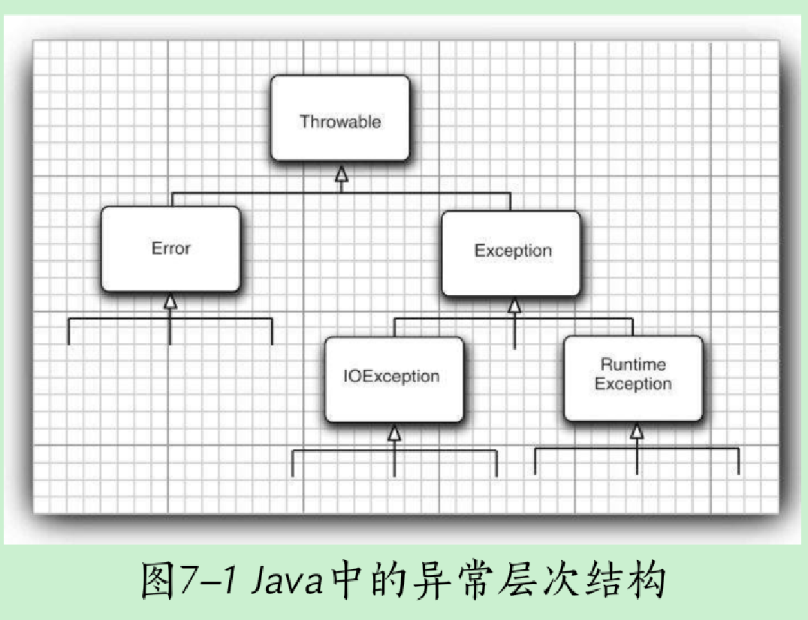

# Java核心技术卷Ⅰ

## 第1章 Java程序设计概述

> *`Java`是一个完整的平台，有一个庞大的库，其中包含了很多可重用的代码和一个提供诸如安全性、跨操作系统的可移植性以及自动垃圾收集等服务的执行环境。*

### Java“白皮书”的关键术语

1. 简单性
    1. `Java`语法是`C++`的一个”纯净“版本。
    2. 简单的另一个方面是小。`Java`的目标之一是支持开发能够在小型机器上独立运行的软件。
2. 面向对象
3. 分布式
4. 健壮性
5. 安全性
6. 体系结构中立
    1. 编译器生成一个体系结构中立的目标文件格式（字节码），这是一种编译过的代码，只要有`Java`运行时系统，这些编译后的代码可以在许多处理器上运行。
    2. 解释虚拟机指令肯定会比全速运行机器指令慢很多，然而`JVM`有一个选项，可以将执行最频繁的字节码序列翻译成机器码，这一过程被称为及时编译。
7. 可移植性
8. 解释性
9. 高性能
10. 多线程
11. 动态性
    1. 在`Java`中找出运行时类型信息十分简单

### Java发展历史

| 版本     | 发布时间 | 名称      |
| -------- | -------- | --------- |
| JDK Beta | 1995     | WebRunner |
|JDK 1.0 |1996.1| Oak|
|  JDK 1.1| 1997.2|  |
|J2SE 1.2| 1998.12 |Playground|
|  J2SE 1.3 |2000.5 |Kestrel |
| J2SE 1.4 |2002.2 |Merlin |
| J2SE 5.0 |2004.9| Tiger |
| Java SE 6 |2006.12| Mustang|
|  Java SE 7| 2011.7|Dolphin|
|  Java SE 8 (LTS)| 2014.3 ||
| Java SE 9 |2017.9||
| Java SE 10 (18.3) |2018.3||
|  Java SE 11 (18.9 LTS)| 2018.9 ||
| Java SE 12 (19.3)| 2019.3||
|  Java SE 13 (19.9)| 2019.9||
|  Java SE 14 (20.3)| 2020.3||

## 第2章 Java程序设计环境

### 使用命令行工具

```shell
javac Welcome.java
java Welcome
```

## 第3章 Java的基本程序设计结构

### 注释

* 单行注释 `//`

* 多行注释 `/* */`

    * 不支持嵌套

* 文档注释 `/** */`

    * ```java
        /**
         * This is the first sample program in Core Java Chapter 3
         * @version 1.0
         * @author dk
         */
        public class FirstSample{
          public static void main(String[] args){
            System.out.println("Hello, World")
          }
        }
        ```

### 数据类型

8种基本数据类型

* 4种整型
    * byte   1字节  8位    -2^7 ~ 2^7 - 1
    * short  2字节 16位  -2^15 ~ 2^15 - 1
    * int       4字节 32位  -2^31​ ~ 2^31- 1 （21亿）
    * long    8字节 64位  -2^63 ~ 2^63 - 1 后缀加L
    * 十六进制  0x
    * 八进制      0
    * 二进制      0b
    * Java没有任何无符号类型（unsigned），kotlin有
* 2种浮点类型
    * float      4字节 1位符号位 8位指数位（决定大小） 23位小数位（决定精度）  有效位数6-7位 后缀加F
    * double  8字节 1位符号位 11位指数位 52位小数位 有效位数15位  后缀可以加D，不强制，不加D默认浮点数值类型也是double类型
* 1种字符类型
    * char  2字节  范围从\u0000到\uffff
* 1种布尔类型
    * boolean true false 整型值和布尔值之间不能互转

### 常量

* final修饰 一旦赋值，就不能再更改了
* (public) static final 类常量

### 运算符

* 整数被0除会产生一个异常，而浮点数被0除会得到无穷大或者NaN结果

* floorMod()和%区别

    * ```java
        //如果参数的符号相同
        floorMod(4, 3) == 1;   and (4 % 3) == 1
        ```

    * ```java
        //如果参数的符号不同
        floorMod(+4, -3) == -2;   and (+4 % -3) == +1
        floorMod(-4, +3) == +2;   and (-4 % +3) == -1
        floorMod(-4, -3) == -1;   and (-4 % -3) == -1
        ```

* 数值类型转换

    * 如果一个数是double类型，另一个操作数就会转换成double类型
    * 否则如果一个数是float类型，另一个操作数就会转换成float类型
    * 否则如果一个数是long类型，另一个操作数就会转换成long类型
    * 否则两个数都会将转换成int类型

* 强制类型转换

    * 浮点数类型转换成整数类型，会截断小数部分

        * ```java
            double a = 9.999;
            int b = (int)a;
            
            b = 9
            ```

    * 四舍五入可以使用Math.round()方法

### 字符串

* 当一个字符串一一个非字符串的值进行拼接的时候，后者被转换成字符串

* String.equals()比较两个字符串值是否相等，==比较两个字符串是否在同一个位置上

* jdk5.0 引入StringBuilder类，这个类的前身是StringBuffer，其效率稍有些低，但允许采用多线程的方式之慈宁宫添加或删除字符的操作。如果所有字符串在一个单线程中编辑，则应该使用StringBuilder替代它。这两个类的API是相同的。

* 格式化字符串 printf

    * 转换符

        | 转换符 |         类型         |   举例   |
        | :----: | :------------------: | :------: |
        |   d    |      十进制整数      |   123    |
        |   x    |     十六进制整数     |    9f    |
        |   o    |      八进制整数      |   257    |
        |   e    |      指数浮点数      | 1.59e+01 |
        |   g    |      通用浮点数      |    -     |
        |   a    |    十六进制浮点数    | 0x1.fccd |
        |   s    |        字符串        |  Hello   |
        |   c    |         字符         |    H     |
        |   b    |         布尔         |   True   |
        |   h    |        散列码        |  456416  |
        | tx或Tx |       日期时间       |    -     |
        |   %    |        百分号        |    %     |
        |   n    | 与平台有关的行分隔符 |    -     |
        |   f    |      定点浮点数      |   15.9   |

    * 标志

        |        标志        |                             目的                             |     举例     |
        | :----------------: | :----------------------------------------------------------: | :----------: |
        |         +          |                     打印正数和负数的符号                     |   +333.33    |
        |        空格        |                       在正数之前加空格                       | \|  333.33\| |
        |         0          |                          数字前补0                           |   00333.33   |
        |         -          |                            左对齐                            | \|333.33  \| |
        |         (          |                       将负数括在括号内                       |  （333.33）  |
        |         \.         |                        添加分组分隔符                        |  33,333.33   |
        |  \#（对于f格式）   |                          包含小数点                          |    3,333.    |
        | \#（对于x或0格式） |                        添加前缀0x或0                         |    0xab12    |
        |         $          | 给定被格式化的参数索引，例如%1\$d,%1\$x将以十进制和十六进制打印第一个参数 |    159 9F    |
        |         <          | 格式化前面说明的数值，例如%d%<x以十进制和十六进制打印同一个数值 |    159 9F    |

        可以使用多个标志
        
    * 日期转换符
    
        * * 
    
        | 转换符 | 类型                                                    | 举例                         |
        | ------ | ------------------------------------------------------- | ---------------------------- |
        | c      | 完整的日期和时间                                        | Mon Feb 09 18:05:11 PST 2004 |
        | F      | ISO 8061日期                                            | 2004-02-09                   |
        | D      | 美国格式的日期                                          | 02/09/2004                   |
        | T      | 24小时时间                                              | 18:03:23                     |
        | r      | 12小时时间                                              | 05:03:23 pm                  |
        | R      | 24小时时间没有秒                                        | 18:05                        |
        | Y      | 4位数字的年（前面补0）                                  | 2004                         |
        | y      | 年的后两位数字（前面补0）                               | 04                           |
        | C      | 年的前两位数字（前面补0）                               | 20                           |
        | B      | 月的完整拼写                                            | February                     |
        | b或h   | 月的缩写                                                | Feb                          |
        | m      | 两位数字的月（前面补0）                                 | 02                           |
        | d      | 两位数字的日（前面补0）                                 | 09                           |
        | e      | 两位数字的月（前面不补0）                               | 9                            |
        | A      | 星期几的完整拼写                                        | Monday                       |
        | a      | 星期几的缩写                                            | Mon                          |
        | j      | 三位数的年中的日子（前面补0），在001到366之间           | 069                          |
        | H      | 两位数字的小时（前面补0），在0到23之间                  | 18                           |
        | k      | 两位数字的小时（前面不补0）在0到23之间                  | 8                            |
        | I      | （大写的i）	两位数字的小时（前面补0），在0到12之间   | 06                           |
        | l      | （小写的L）	两位数字的小时（前面不补0），在0到12之间 | 6                            |
        | M      | 两位数字的分钟（前面补0）                               | 05                           |
        | S      | 两位数字的秒（前面补0）                                 | 19                           |
        | L      | 三位数字的毫秒（前面补0）                               | 047                          |
        | N      | 九位数字的毫微秒（前面补0）                             | 047000000                    |
        | P      | 上午或者下午的大写标志                                  | PM                           |
        | p      | 上午或者下午的小写标志                                  | pm                           |
        | z      | 从GMT起，RFC822数字移位                                 | -0800                        |
        | Z      | 时区                                                    | PST                          |
        | s      | 从格林威治时间1970-01-01 00:00:00起的秒数               | 107884319                    |
        | Q      | 从格林威治时间1970-01-01 00:00:01起的毫秒数             | 107884319047                 |


### 控制流程

* break

    * 用于退出循环语句

    * 用于退出嵌套循环

        ```java
        tag:
        for (int i = 0; i < 10; i++) {
          for (int j = 0; j < 10; j++) {
            if (j == 2)
              break tag;
          }
        }
        ```


### 大数值

* BigInteger 整数

    ```java
    BigInteger a = BigInteger.valueOf(100);
    BigInteger b = a.add(BigInteger.valueOf(20));
    BigInteger c = b.multiply(a);
    ```

* BigDecimal 浮点数

### 数组

* 初始化

```java
int[] array = new int[]{100, 100};
int[] array1 = {100, 100};
int[] array2 = new int[0];
System.out.printf("%s %s %s", array.length, array1.length, array2.length);

2 2 0
```

在Java中，允许数组长度为0，但是数组长度为0与null不同

* 数组拷贝

    ```java
    // 引用拷贝
    int[] luckyNumbers = samllPrimes;
    luckyNumbers[2] = 90; //luckyNumbers[2] is also 90
      
    // 值拷贝
    int copiedLuckyNumbers = Arrays.copyOf(luckyNumbers, luckyNumbers.length);
    // 第二个参数是新数组长度，通常用来增加数组的大小，如果是数值型，那么多余的数组被赋值为0，布尔型被赋值为false。相反如果长度小于原来数组的长度，则只会拷贝前面的数据元素
    luckyNumbers = Arrays.copyOf(luckyNumbers, luckyNumbers.legth * 2);
    ```

* 数组排序

    `Arrays.sort(luckyNumbers)` 改变原数组

* 多维数组

    `double[][] blances`

* 不规则数组

## 第4章 对象与类

### 面向对象程序设计概述

* 面向对象程序设计 OOP(Object Oriented Program)

* 在OOP中，不必关心对象的具体实现，只要满足用户的需求即可

* 类（class）是构造对象的模板或蓝图。由类构造（construct）对象的过程称为创建类的实例（instance）

* 对象中的数据称为实例域（instance field），操作数据的过程称为方法（method）

* 实现封装的关键在于绝对不能让类中的方法直接地访问其他类的实例域

* 在扩展一个类的时候，这个扩展后的心累具有所扩展类的全部属性和方法，在新类中只需提供适合这个新类的方法和数据域就可以了

* 类与类之间的常见关系

    * 依赖（uses-a）

        如果一个类的方法操纵另一个类的对象，我们就说一个类依赖另一个类

    * 聚合（has-a）

        一个Order对象包含一些Item对象，聚合关系意味着类A包含类B的对象

    * 继承（is-a）

### 使用预定义类

* 一个对象变量并没有实际包含一个对象，而仅仅是引用了一个对象，在Java中，任何对象变量的值都是对存储在另外一个地方的一个对象的引用

* LocalDate 用来处理日历

    ```java
    LocalDate today = LocalDate.now();
    int somedays = today.getDayOfMonth() - 1;
    int month = today.getMonthValue();
    LocalDate firstDay = today.minusDays(somedays);
    
    System.out.println("Mon Tue Wed Thu Fri Sat Sun");
    for (int i = 0; i < firstDay.getDayOfWeek().getValue() - 1; i++) {
      System.out.print("    ");
    }
    while (firstDay.getMonthValue() == month) {
      System.out.printf("%3d", firstDay.getDayOfMonth());
    
      if (firstDay.getDayOfMonth() == today.getDayOfMonth()) {
        System.out.print("*");
      } else {
        System.out.print(" ");
      }
    
      if (firstDay.getDayOfWeek() == DayOfWeek.SUNDAY) {
        System.out.println();
      }
    
      firstDay = firstDay.plusDays(1);
    }
    ```

### 用户自定义类

```java
class Employee{
  // instance fields
  private String name;
  private double salary;
  private LocalDate hireDay;
  
  // constructor
  public Employee(String n, double s, int year, int month, int day){
    name = n;
    salary = s;
    hireDay = LocalDate.of(year, month, day);
  }
  
  // a method
  public String getName(){
    return name;
  }
  
  // more methods
}
```

* 构造器

    * 构造器和类同名
    * 每个类可以有一个以上的构造器
    * 构造器可以有0个、1个或多个参数
    * 构造器没有返回值
    * 构造器总是伴随着new操作一起调用

* 隐式参数和显示参数

    ```java
    public void raiseSalary(double byPercent){
      double raise = salary * byPercent / 100;
      salary += raise
    }
    ```

    * raiseSalary方法有两个参数。第一个参数称为隐式（implicit）参数，即方法名前面出现的Employee类对象。第二个参数位于方法名后面括号中的数值，这是一个显示（explicit）参数。（有人把隐式参数称为方法调用的目标或者接受者）在每一个方法中，关键字this表示隐式参数

* 不要编写返回引用可变对象的访问器方法，如果需要返回一个对象的引用，应该首先对它进行克隆（clone）

    ```java
    class Employee{
      public Date getHireDay(){
        return (Date)hireDay.clone();
      }
    }
    ```

* final实例域

    * 可以将实例域定义为final。构建对象时必须初始化这样的域。也就是说，必须确保在每一个构造器执行之后，这个域的值被设置，并且后面的操作中，不能再对它进行修改

### 静态域与静态方法

* 静态域
    * `private static int indexId = 1 `它属于类，而不属于任何独立的对象
* 静态常量
    * `public static final double PI = 3.141592653589793`
* 静态方法
    * 静态方法是一种不能向对象实施操作的方法。
    * `Math.pow(x, a)`在运算时，不使用任何Math对象。换句话说，没有隐式参数
    * 可以认为静态方法是没有this参数的方法
    * 对象可以调用静态方法，但是不推荐，原因是静态方法的计算结果和对象毫无关系，容易造成混淆，建议使用类名调用
    * 下面两种情况下使用静态方法
        * 一个方法不需要访问对象状态，其所需参数都是通过显示参数提供（如：Math.pow）
        * 一个方法只需要访问类的静态域
    * 工厂方法
        * LocalDate.now
        * LocalDate.of
        * 为什么不利用构造器完成这些操作
            * 无法命名构造器
            * 当使用构造器时，无法改变所构造的对象类型

### 方法参数

按值调用（call by value）表示方法接收的是调用者提供的值

按引用调用（call by reference）表示方法接收的是调用者提供的变量地址

一个方法可以修改传递引用所对应的变量值，而不能修改传递值调用所对应的变量值

**Java程序设计语言总是采用按值调用。也就是说，方法得到的是所有参数值的一个拷贝，特别是，方法不能修改传递给它的任何参数变量的内容**

很多程序设计语言（特别是C++和Pascal）提供了两种参数传递的方式：值调用和引用调用。有些程序员认为Java程序设计语言对对象采用的是引用调用，实际上，这种理解是不对的。例如：

```java
public static void swap(Employee x, Employee y){
  Employee temp = x;
  x = y;
  y = temp
}

public static void main(String[] args){
  Employee a = new Employee("Tom", 8888, 1990, 1, 1);
  Employee b = new Employee("Jack", 9999, 2000, 1, 2);
  swap(a, b)
}
```

如果Java对对象采用的是按引用调用，那么这个方法实现交换数据的效果，但是方法并没有改变存储在变量a和b中的对象引用。swap方法的参数x和y被初始化为两个对象引用的拷贝，这个方法交换的是这两个拷贝。在方法结束时参数变量x，y被丢弃了，原来变量a和b仍然引用这个方法调用之前所引用的对象

* 一个方法不能修改一个基本数据类型的参数
* 一个方法可以改变一个对象参数的状态
* 一个方法不能让对象参数引用一个新的对象

### 对象构造

* 重载（overloading）

    如果多个方法，有相同的名字、不同的参数，便产生了重载。

    要完整地描述一个方法，需要指出方法名以及参数类型。这叫做方法的签名（signature）。返回类型不是方法签名的一部分，也就是说不能有两个名字相同、参数类型也相同但却返回不同类型值的方法

* 默认域初始化

    * 类中的域可以不初始化，没有初始化类中的域，将会被自动初始化为默认值（0、false、null）
    * 局部变量必须进行初始化

* 无参数的构造器

    * 很多类都包含一个无参数的构造函数，对象由无参数构造函数创建时，其状态会设置为适当的默认值
    * 仅当类没有提供任何构造器的时候，系统才会提供一个默认的构造器

* 调用另一个构造器

    this()

* 初始化块（initialization block）

    `{}`构造类的对象，这些块就会执行

* 对象析构与finalize方法

    finalize方法将在垃圾回收器清除对象之前调用。在实际应用中，不要依赖于使用finalize方法回收任何短缺的资源，这是因为很难知道这个方法什么时候才能够调用

### 包

* 类的导入

    * `java.time.LocalDate today = java.time.LocalDate.now();`

    * ```java
        import java.util.*;
        
        LocalDate today = LocalDate.now();
        ```

    * ```java
        import java.util.LocalDate;
        
        LocalDate today = LocalDate.now();
        ```

* 静态导入

    * `import static java.lang.System`

* 将类放入包中

    * `package com.dk.corejava`

* 包的作用域

    * default修饰的类可以被包内的所有方法访问

### 类路径

* 类存储在文件系统的子目录中，类的路径必须与包名匹配
* 类文件也可以存储在JAR（JAVA归档）文件中（JAR文件使用ZIP格式组织文件和子目录，可以使用所有ZIP应用程序查看JAR文件）

### 文档注释

JDK包含一个很有用的工具，叫做javadoc，它可以由源文件生成一个HTML文档

* javadoc会从下面几个特征中抽取信息：
    * 包
    * 公有类与接口
    * 公有的和受保护的构造器及方法
    * 公有的和受保护的域

* 类注释

    ```java
    /**
     * 一个员工类
     */
    public class Employee{
      
    }
    ```

* 方法注释

    ```java
    /**
     * 给一个员工加薪
     * @param byPercent 加薪的百分比（例如：10就是10%）
     * @return 加薪的数额
     */
    public double raiseSalary(double byPercent){
      double raise = salary * byPercent / 100;
      salary += raise;
      return raise;
    }
    ```

* 域注释

    只需要对公有域（通常指的是静态常量）建立文档

    ```java
    /**
     * 员工的类型：老板
     */
    public static final int BOSS = 1;
    ```

* 通用注释

    @author dk

    @version 1.2

    @since version 1.1

    @deprecated

    @see

### 类设计技巧

* 一定要保证数据私有
    * 这是最重要的，绝对不能破坏封装性。
    * 有时候需要编写一个访问器方法或者更改器方法，但是最好还是保持实例域的私有
* 一定要对数据初始化
    * Java不会对局部变量进行初始化，但是会对对象的实例域进行初始化
    * 最好不要依赖系统的默认值，而是应该县实地初始化所有的数据，具体的初始化方式可以是提供默认值，也可以在所有构造器中设置默认值
* 不要在类中使用过多的基本数据类型
    * 就是说，用其他的类代替多个相关的基本类型的使用
    * 例如：一个Address类代替一个Customer类中的`private String street` `private String city` `private String state` `private int zip`
* 不是所有的域都需要独立的域访问器和修改器
* 将职责过多的类进行分解
* 类名和方法名要能体现它们的职责
* 优先使用不可变的类
    * LocalDate类以及java.time包中的其他类是不可变--没有方法能修改对象的状态。类似plusDays方法并不是更改对象，而是返回状态以及修改的新对象

## 第5章 继承

###  类、超类和子类

* 定义子类

    * ```java
        public class Manager extends Employee{
          //添加域和方法
          private double bonus;
        }
        ```

* 覆盖方法

    子类可以覆盖（override）父类的方法

    ```java
    public double getSalary(){
      double baseSalary = super.getSalary();
      return baseSalary + bonus
    }
    ```

    有些人认为super与this引用是类似的概念，实际上，这样比较并不恰当。这是因为super不是一个对象的引用，不能将super赋给另一个对象变量，它只是一个指示编译器调用超类方法的特殊关键字。

* 子类构造器

    ```java
    public Manager(String name, double salary, int year, int month, int day){
      // 使用super调用构造器的语句必须是子类构造器的第一条语句
      super(name, salary, year, month, day);
      bonus = 0;
    }
    ```

    如果子类的构造器没有显示地调用父类的构造器，则将自动地调用父类默认（没有参数）的构造器。如果父类没有不带参数的构造器，并且子类构造器中又没有显示地调用父类的其他构造器，则Java编译器报错。

* 多态

    有一个用来判断是否应该设计为继承关系的简单规则，这就是“is-a”规则，它表明子类的每个对象也是父类的对象。

* 理解方法调用

    * 静态绑定 private static final修饰或者构造器
    * 动态绑定 调用方法依赖隐式参数的实际类型

    在覆盖一个方法的时候，子类方法不能低于父类方法的可见性。

* 阻止继承：final类和方法

    * 如果一个类声明为final，只有其中的方法自动地成为final，而不包括域

* 强制类型转换

    * 只能在继承层次内进行类型转换
    * 在将父类转换成子类之前，应该使用instanceof进行检查

* 抽象类

    * 包含一个或多个抽象方法的类必须声明为抽象类
    * 抽象类还可以包含具体数据和方法

    ```java
    public abstract class Person{
      private String name;
      
      public Person(String name){
        this.name = name
      }
      
      public String getName(){
        return this.name;
      }
      
      public abstract String getDescription();
    }
    ```

    * 扩展抽象类可以有两种选择，一种是在抽象类中定义部分抽象类方法或不定义抽象类方法，这样就必须将子类也标记为抽象类；另一种是定义全部的抽象方法，这样一来，子类就不是抽象类。

* 受保护访问

    * private 仅对本类可见
    * public 对所有类可见
    * protected 对本包和所有子类可见
    * 默认 对本包可见

### Object：所有类的超类

* equals方法

    在Object类中，这个方法将判断两个对象是否具有相同的引用。

* 相等测试与继承

    如果隐式和显示参数不属于同一个类，equals方法将如何处理呢？

    `if(!(otherObject instanceof Employee)) return false`许多程序员喜欢使用instanceof进行检测，这样做非但没有解决otherObject是子类的情况，并且还有可能招致一些麻烦。

    下面给出编写一个完美的equals方法的建议：

    1. 显示参数命名为otherObject，稍后需要将它转换成为另一个叫做other的变量。
    2. 检测this与otherObject是否引用同一个对象`if(this == otherObject) return true;`
    3. 检测otherObject是否为null，如果为null则返回false`if(otherObject == null) return false;`
    4. 比较this与otherObject是否属于同一个类`if(getClass() != otherObject.getClass()) return false;`如果所有的子类都拥有统一的语义，就使用`if(!(otherObject instanceof Employee)) return false;`
    5. 将otherObject转换为相应的类类型变量 `ClassName other = (ClassNmae)otherObject;`
    6. 现在开始对所有需要比较的域进行比较了。使用`==`比较基本类型，使用`equals`比较对象域（如果是数组类型的域可以使用Arrays.equals方法）。如果所有的域都匹配，就返回true，否则返回false

* hashCode方法

    散列码（hashcode）是由对象导出的一个整型值。散列码是没有规律的。如果x和y是两个不同的对象，x.hashCode()和y.hashCode()基本上不会相同。

* toString方法

    用于返回表示对象值的字符串。

    只要一个对象与一个字符串通过操作符“+”连接起来，Java编译就会自动地调用toString方法。

### 泛型数组列表

`ArrayList<T> array = new ArrayList<>();`

一旦能够确定数组列表的大小不再发生变化，就可以调用trimToSize方法。这个方法将存储区域的大小调整为当前元素数量所需要的存储数目。垃圾回收器将回收多余的存储空间。

* 访问数组列表元素

    * add 添加元素 set 设置元素（它只能替换数组中已经存在的元素）

    * 下面这个技巧可以一举两得，既可以灵活地扩展数组，又可以方便地访问数组元素。

        ```java
        ArrayList<X> list = new ArrayList<>();
        n = 0
        while(n < 10){
          list.add(X);
        	n++;
        }
        
        X[] a = new X[list.size()];
        list.toArray(a);
        ```

* 类型化与原始数组列表的兼容性

### 对象包装器与自动装箱

有些时候需要将int这样的基本类型转换为对象。所有的基本类型都有一个对应的类。这些类称为包装器（wrapper）。Integer、Long、Float、Double、Short、Byte、Character、Void、Boolean前6个类派生于公共的父类Number。对象包装器类是不可变的，即一旦构造了包装器，就不允许更改其中的值。同时，对象包装器还是final，因此不能定义他们的子类。

* 由于每个值分别包装在对象中，所以`ArrayList<Integer>`的效率远远低于`int[]`数组。
* 自动装箱规范要求boolean、byte、char <= 127，介于-128~127之间的short和int被包装到固定的对象中。

### 参数数量可变的方法

允许将一个数组传递给可变参数方法的最后一个参数。

### 枚举类

```java
public enum Size{
    SMALL("S"),MEDIUM("M"),LARGE("L"),EXTRA_LARGE("XL");
    
    private String abbreviation;
    
    public Size(String abbreviation){
        this.abbreviation = abbreviation;
    }
    
    public String getAbbreviation(){
        return abbreviation;
    }
}
```

### 反射

* 反射机制可以用来：

    * 在运行时分析类的能力
    * 在运行时查看对象，例如，编写一个toString方法供所有类使用
    * 实现通用的数组操作代码
    * 利用Method对象

* Class类

    ```java
    Employee e;
    // 第一种获取Class对象
    Class cl = e.getClass();
    e.getClass().getName();
    
    String className = "java.util.Random";
    // 第二种获取Class对象
    Class cl = Class.forName(className);
    
    // 第三种获取Class对象
    Class cl1 = Random.class;
    Class cl2 = int.class;
    Class cl3 = Double[].class;
    // 请注意，一个Class对象实际上表示的是一个类型，而这个类型未必一定是一种类。int不是类，但是int.class是一个Class类型的对象
    ```

    * Class实际上是一个泛型类。`Employee.class`的类型是`Class<Employee>`

    * 可以使用==运算符实现两个类对象的比较

        `if(e.getClass == Employee.class)`

    * 动态地创建一个类的实例

        `e.getClass().newInstance();`newInstance方法调用默认的构造器（没有参数的构造器），如果这个类没有无参构造器的话，就会抛出异常。

* 捕获异常

    * 异常有两种类型：

        * 未检查异常
            * 例如访问null引用
        * 已检查异常
            * 编译器会检查是否提供了处理器

    * ```java
        try{
          String name = ...;
          Class cl = Class.forName(name);
         
        }catch(Exception e){
          e.printStackTrace();
        }
        ```

* 利用反射分析类的能力

    * 检查类的结构

        在java.lang.reflect包中有三个类Field、Method和Constructor分别用于描述类的域、方法和构造器。这三个类都有一个getName方法用来返回项目的名称。Field类有一个getType方法用来返回描述域所属类型的Class对象。Method和Constructor类有能报告参数类型的方法。Method类还有一个能够报告返回类型的方法。这三个类还有getModifiers的方法，它将返回一个整型数值，用来描述public和static这样的修饰符。

    ```java
    public static void main(String... args) {
      String name;
      if (args.length > 0) name = args[0];
      else {
        Scanner in = new Scanner(System.in);
        System.out.println("Enter class name(e.g. java.util.Date):");
        name = in.next();
      }
    
      try {
        Class cl = Class.forName(name);
        Class supercl = cl.getSuperclass();
        String modifiers = Modifier.toString(cl.getModifiers());
        if (modifiers.length() > 0) System.out.print(modifiers + " ");
        System.out.print("class " + name);
        if (supercl != null && supercl != Object.class) System.out.println(" extends " + supercl.getName());
        System.out.println("{");
    
        printConstructors(cl);
        printMethods(cl);
        printFields(cl);
    
      } catch (Exception e) {
        e.printStackTrace();
      }
      System.exit(0);
    }
    
    /**
         * 打印所有的域
         *
         * @param cl 一个Class对象
         */
    private static void printFields(Class cl) {
      Field[] fields = cl.getDeclaredFields();
    
      for (Field f : fields) {
        Class type = f.getType();
        String name = f.getName();
        System.out.print("  ");
        String modifiers = Modifier.toString(f.getModifiers());
        if (modifiers.length() > 0) System.out.print(modifiers);
        System.out.println(type.getName() + " " + name + ";");
      }
    }
    
    /**
         * 打印所有方法
         *
         * @param cl 一个Class对象
         */
    private static void printMethods(Class cl) {
      Method[] methods = cl.getDeclaredMethods();
    
      for (Method m : methods) {
        Class retType = m.getReturnType();
        String name = m.getName();
    
        System.out.print("  ");
        printModifiers(m);
        System.out.print(retType.getName() + " " + name + "(");
        //打印参数
        printParams(m);
      }
      System.out.println();
    }
    
    /**
         * 打印所有的构造方法
         *
         * @param cl 一个Class对象
         */
    private static void printConstructors(Class cl) {
      Constructor[] constructors = cl.getDeclaredConstructors();
    
      for (Constructor c : constructors) {
        String name = c.getName();
        System.out.print("  ");
        printModifiers(c);
        System.out.print(name + "(");
        printParams(c);
    
      }
      System.out.println();
    }
    
    private static void printParams(Executable executable) {
      //打印参数
      Class[] paramTypes = executable.getParameterTypes();
      for (int i = 0; i < paramTypes.length; i++) {
        if (i > 0) System.out.print(", ");
        System.out.print(paramTypes[i].getName());
      }
      System.out.println(");");
    }
    
    private static void printModifiers(Executable executable) {
      String modifiers = Modifier.toString(executable.getModifiers());
      if (modifiers.length() > 0) System.out.print(modifiers + " ");
    }
    ```

* 在运行时使用反射分析对象

* 使用反射编写泛型数组代码

* 调用任意方法

* 继承的设计技巧

    * 将公共操作和域放在父类
    * 不要使用受保护的域
    * 使用继承实现”is-a“关系
    * 除非所有继承的方法都有意义，否则不要使用继承
    * 在覆盖方法的时候，不要改变预期的行为
    * 使用多态，而不是类型信息
    * 不要过多地使用反射

## 第6章 接口、lambda表达式与内部类

### 接口

* 接口概念

    接口不是类，而是对类的一组需求描述，这些类要遵从接口描述的统一格式进行定义。

    * 接口中的所有方法自动地属于public

* 接口的特性

    * 虽然接口中不能包含实例域和静态方法（Java8中允许在接口中增加静态方法），但可以包含常量，接口中的域将自动地被设为public static final
    * 接口可以多实现

* 接口与抽象类

    * 使用抽象类表示通用属性存在这样的一个问题：每个类只能扩展一个类

* 静态方法

    * Java 8出现
    * 通常做法都是讲静态方法放在伴随类中。在标准库中，你会看到成对出现的接口和实用工具类，例如：Collection/Collections或Path/Paths

* 默认方法

    * 可以为接口提供一个默认实现
    * 必须使用default修饰符标记

* 解决默认方法冲突

    如果现在一个接口中将一个方法定义为默认方法，然后又在超类或者另一个接口中定义了相同的方法，会怎么处理？

    * 超类优先。如果超类提供了一个具体方法，同名而且有相同参数类型的默认方法会被忽略
    * 接口冲突。如果一个超接口提供一个默认方法，另一个接口提供了一个同名且参数类型相同的方法，必须覆盖这个方法来解决冲突

    一个类扩展了一个超类，同时实现了一个接口，并从超类和接口中继承了相同的方法，会怎么处理？

    * 这种情况下，只会考虑超类方法。“类优先”原则

### 接口示例

* 接口与回调

    回调（Callback）是一种常见的程序设计模式。在这种模式中，可以指出某个特定时间发生时应该采取的动作。

* Comparator接口

* 对象克隆

    * Object.clone提供的浅拷贝
    * 即使clone的默认（浅拷贝）实现能够满足要求，还是需要实现Cloneable接口，将clone重新定义为public，再调用super.clone()
    * 如果在一个对象上调用clone，但这个对象的类并没有实现Cloneable接口，Object类的clone就会抛出一个CloneNotSupportedException

    ```java
    class Employee implements Cloneable{
    	public Employee clone() throws CloneNotSupportedException{
      	// 调用 Object.clone()
        Employee cloned = (Employee)super.clone();
        
        // 克隆可变对象
        cloned.hireDay = (Date)hireDay.clone();
        
        return cloned;
    	}
    }
    ```

    

### lambda表达式

* 为什么引入lambda表达式

    * lambda表达式是一个可传递的代码块，可以在以后执行一次或多次
    * 一直以来，在Java中传递一个代码块并不容易，不能直接传递代码块。

* lambda表达式的语法

    ```java
    (String first, String second) ->{
      if(first.length() < second.length()) return -1;
      else if(first.length() > second.length()) return 1;
    	else return 0;
    }
    
    () -> {
      for(int i = 0; i < 10; i++)System.out.println(i);
    }
    
    (String first, String second) -> first.length() - second.length()
    ```

* 函数式接口

    对于只有一个抽象方法的接口，需要这种接口的对象时，就可以提供一个lambda表达式。这种接口称为函数式接口（functional interface）。

* 方法引用

    ```java
    Timer t = new Timer(1000, event -> System.out.println(event));
    
    // 直接将方法传递到Timer构造器
    Timer t = new Timer(1000, System.out::println);
    
    Arrays.sort(strings, String::compareToIgnoreCase);
    ```

* 构造器引用

* 变量作用域

    * lambda表达式可以捕获外围作用域中变量的值
    * lambda表达式中，只能引用值不会改变的变量

* 处理lambda表达式

* 再谈Comparator

### 内部类

内部类（inner class）是定义在另一个类中的类。

* 为什么要使用内部类？
    * 内部类方法可以访问该类定义所在的作用域中的数据，包括私有的数据
    * 内部类可以对同一个包中的其他类隐藏起来
    * 当想要定义一个回调函数且不想编写大量代码时，使用匿名内部类比较便捷

* 使用内部类访问对象状态
* 内部类的特殊语法规则
    * 外部类引用`OuterClass.this`
    * 在外部类的作用域外引用公有内部类`OuterClass.InnerClass`
    * 内部类中声明的所有静态域都必须是final
    * 内部类不能有static方法
* 内部类是否有用、必要和安全
    * 内部类是一种编译器现象，与虚拟机无关。编译器会把内部类翻译成用`$`分割外部类与内部类的常规类文件，而虚拟机则对此一无所知`OuterClass$InnerClass.class`

* 局部内部类

    * 局部类不能用public或private修饰
    * 局部类有一个优势，即对外部类可以完全的隐藏起来

    ```java
    public void start(){
      class TimePrinter implements ActionListener{
        public void actionPerformed(ActionEvent event){
          System.out.println("At the tone, the time is " + new Date());
          if(beep)Toolkit.getDefaultToolkit().beep();
        }
      }
    }
    ```

* 由外部方法访问变量

    * 与其他内部类相比较，局部类还有一个优点。它们不仅能够访问包含它们的外部类，还可以访问局部变量。不过，那些局部变量必须事实上为final。这说明，它们一旦赋值就绝不会改变。

* 匿名内部类

    假如只创建这个类的一个对象，就不必命名了。这种类被称为匿名内部类（anonymous inner class）。

    ```java
    // 通常语法格式
    new SuperType(construction parameters){
      inner class methods and data
    }
    ```

* 静态内部类

    有时候，使用内部类只是为了把一个类隐藏在另一类的内部，并不需要引用外部类的对象。为此，可以将内部内声明为static，以便取消产生的引用。

    * 在内部类不需要访问外部类对象的时候，应该使用静态内部类。有些程序员用嵌套类（nested class）表示静态内部类
    * 与常规内部类不同，静态内部类可以有静态域和方法
    * 声明在接口中的内部类自动成为static和public类

### 代理（proxy）

利用代理可以再运行时创建一个实现了一组给定接口的新类。这种功能只有在编译时无法确定实现哪个接口时才有必要使用。

* 何时使用代理

* 创建代理对象

    要想创建一个代理对象，需要使用Proxy类的newProxyInstance方法。这个方法有三个参数：

    * 一个类加载器（class loader）。目前，用null表示使用默认的类加载器
    * 一个Class对象数组，每个元素都是需要实现的接口
    * 一个调用处理器

* 代理类的特性

## 第7章 异常、断言和日志

### 处理错误

如果由于出现错误而使得某些操作没有完成，程序应该：返回到一种安全状态，并能够让用户执行一些其他的命令；或者允许用户所保存所有操作的结果，并以妥善的方式终止程序。

* 异常分类

    

* Error类层次结构描述了Java运行时系统内部错误和资源耗尽错误。应用程序不应该抛出这种类型的对象。如果出现了这样的错误，除了通知给用户，并尽力使程序安全地终止之外，再也无能为力了。这种情况很少出现。

* Exception

    * RuntimeException：由程序错误导致的异常属于RuntimeException
        * 错误的类型转换
        * 数组访问越界
        * 访问null指针
    * 其他异常：而程序本身没有问题，但由于I/O错误这类问题导致的异常
        * 试图在文件尾部后面读取数据
        * 试图打开一个不存在的文件
        * 试图根据给定的字符串查找Class对象，而这个字符串表示的类不存在

    如果出现RuntimeException异常，那么就一定是你的问题。