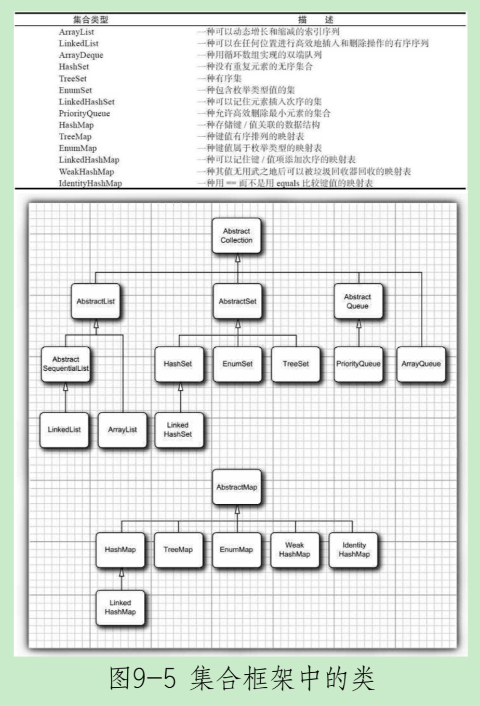

## Java

### 一、面向对象

面向对象程序设计OOP(object oriented programming)是具有对象概念的编程典范。对象则是指的是类的实例。它将对象作为程序的基本单元，将程序和数据封装其中，以提高软件的复用性、灵活性和扩展性。面向对象的程序是由对象组成的，每个对象包含对用户公开的特定功能部分和隐藏的实现部分。

#### 1. 类

类(class)是构造对象的模板或蓝图。

识别类的简单规则是在分析问题的过程中寻找名词，而方法对应着动词。

#### 2. 对象

对象的三个主要特性：

1. 对象的行为(behavior)，可以对对象施加哪些操作，或可以对对象施加哪些方法？
2. 对象的状态(state)，当施加那些方法时，对象如何响应？
3. 对象标识(identity)，如何辨别具有相同行为与状态的不同对象？

一个对象变量并没有实际包含一个对象，而仅仅引用一个对象。在Java中，任何对象变量的值都是对存储在另外一个地方的一个对象的引用。new操作符的返回值也是一个引用。

Java程序设计语言总是采用按值调用。也就是说，方法得到的是所有参数值的一个拷贝，特别是，方法不能修改传递给它的任何参数变量的内容。

#### 3. 封装

从形式上看，封装不过是将数据和行为组合到一个包中，并对对象的使用者隐藏了数据的实现方式。对象中的数据称为实例域(instance field)，操纵数据的过程称为方法(method)。对于每个特定的类实例(对象)都有一组特定的实例域值。这些值的集合就是这个对象的当前状态(state)。无论何时，只要向对象发送一个消息，它的状态就有可能发生改变。

实现封装的关键在于绝对不能让类中的方法直接地访问其他类的实例域。

封装给对象赋予了“黑盒”特征。

访问修饰符：

1. private 仅对本类可见
2. 默认 对本包可见
3. protected 对本包和子类可见
4. public 对所有类可见

#### 4. 继承

继承已存在的类就是复用（继承）这些类的方法和域。在此基础上，还可以添加一些新的方法和域，以满足新的需求。

子类能访问父类protected的域和方法。

#### 5. 多态

一个对象变量可以指示多种实际类型的现象被称为多态。在运行时能够自动地选择调用哪个方法的现象称为动态绑定。

#### 6. 抽象类

包含一个或多个抽象方法的类本身必须被声明为抽象的。

#### 7. 接口

描述类具有什么功能。

接口中的所有方法自动地属于public。

没有实例域。

接口中的域将被自动设为public static final。

Java SE8可以在接口中实现方法以及静态方法-。

#### 8. 接口与回调

回调(callback)是一种常见的程序设计模式。在这种模式中，可以指出某个特定事件发生时应该采取的动作。

#### 9. 反射

能够分析类能力的程序称为反射。

1. 在运行时分析类的能力
2. 在运行时查看对象，例如：编写一个toString方法供所有类使用
3. 实现通用的数组操作代码
4. 利用Method对象，这个对象很像C++中的函数指针

### 二、程序设计

#### 1. 异常

Throwable

* Error Java运行时系统的内部错误和资源耗尽错误。

* Exception

    * RuntimeException 由程序错误导致的异常
        * 错误的类型转换
        * 数组访问越界
        * 访问null指针
    * 其他异常（IOException等）程序本身没有问题，由于I/O错误这类问题导致的
        * 试图在文件尾部后面读取数据
        * 试图打开一个不存在的文件
        * 试图根据给定的字符串查找Class对象，而这个字符串表示的类并不存在

    如果出现RuntimeException异常，那么一定就是你的问题。

    Java将派生于Error类或RuntimeException类的所有异常称为非受查(unchecked)异常，所有其他的异常称为受查异常(checked)异常。编译器将检查是否为所有的受查异常提供了异常处理器。

#### 2. 集合

#### 3. 线程

6种状态（getState方法）：

1. New(新创建)
2. Runnable(可运行)
3. Blocked(被阻塞)
4. Waiting(等待)
5. Timed waiting(计时等待)
6. Terminated(被终止)

