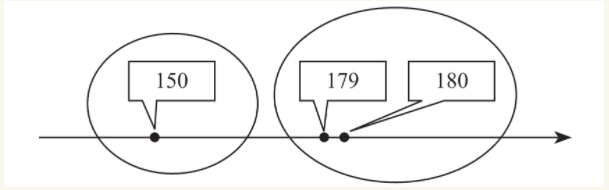
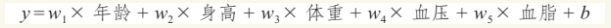

### 第一章 机器学习是什么

#### 机器学习种类

* 从学习的种类来说,最常见的我们习惯分为两种:
	* 无监督学习(unsupervised learning)
	* 有监督学习(supervised learning)
* 此外还有:
	*  半监督学习(semisupervised learning)
	*  强化学习(reinforcement learning)
	*  等等

#### 聚类(clustering)

>聚类是一种典型的“无监督学习”，是把物理对象或抽象对象的集合分组为由彼此类似的对象组成的多个类的分析过程。

>简单来讲，就是一个归类的过程，我们在动物园看到的金丝猴、猕猴、长鼻猴等，它们都属于猴子类。马路上看到的各种小轿车、卡车、跑车等等，它们都属于汽车类。

比较常用的聚类算法：

* K-Means
* DBSCAN

基本思路都是利用每个向量之间的“距离”--空间中的欧氏距离或者曼哈顿距离，从远近判断是否从属于同一类别。

在用机器做聚类学习的时候，我们每种算法都对应有相应的计算原则，可以把输入的各种看上去彼此“相近”的向量分在同一个群组中。

>看到这个，就想起了**“物以类聚，人以群分”**这句话。正因为如此，我们聚集在此，感谢刚哥，感谢大家！

#### 回归(regression)

>回归是一种解题方法，或者说“学习方法”，也是机器学习中比较重要的内容。
>
>简单来讲，就是“由果索因”的过程，是一种归纳的思想--通过大量的样本，推测出其中蕴含的某种关系。

最常用的回归有两大类：

* 线性回归
	* y = f(x) = wx + b
	
	>这里的w和x分别是1×n（1行n列）和n×1（n行1列）的矩阵。
	
	那么把每一个患者的（年龄、身高、体重、血压、血脂）具体向量值带入，并把血糖程度y	值也代入。至此形成一个六元一次方程组，其中未知数是w1-w5和b，即我们需要通过大量	训练所求的“合适”的解。
	
	* 如何验证呢？
	>
* 非线性回归

